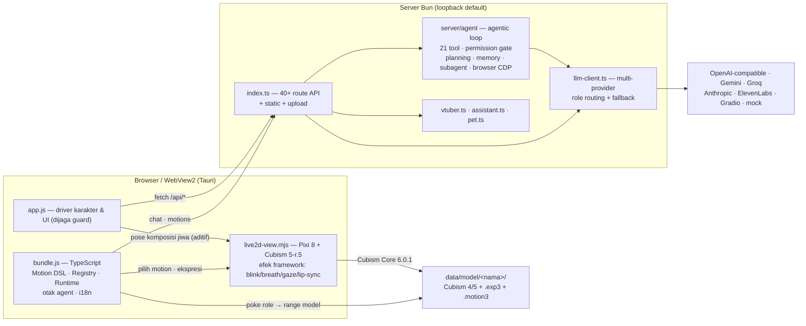

# 🎭 Live2D Agent


Karakter Live2D yang dikendalikan AI — ngobrol lewat teks atau suara, menjawab dengan gerak,
ekspresi, dan suara (TTS), dan **tetap hidup saat kamu diam**: bicara sendiri saat idle,
menyapa saat kamu pergi/balik, membaca mood dari webcam. Runtime **Bun** (zero-dep),
inti logika **TypeScript**, renderer satu jalur **Pixi 8 + Cubism SDK 5-r.5** (Core 6.0.1,
tanpa MOC-version-hack).

> **Model-agnostic:** jalan dengan model Cubism 4/5 **apa pun** yang kamu impor — tanpa
> hardcode nama model, id parameter, atau range. Aturannya mengikat dan dijaga guard
> otomatis: [`docs/MODEL-AGNOSTIC-RULES.md`](docs/MODEL-AGNOSTIC-RULES.md).

## ✨ Sorotan

- **Otak terbagi per peran** — multi-provider LLM dengan *role routing*: otak bicara
  (`chat`), otak akting (`motion`), otak sheet (`sheet`), otak kerja (`assistant`) bisa
  provider/model berbeda + fallback & cooldown otomatis. Prompt pembicara bebas tabel
  parameter → ±3.400 token/pesan dihemat.
- **Akting mengikuti teks** — directive `[EMOTION:] [GESTURE:] [MOTION:] [PROP:] …`
  diparse jadi gerak multi-layer (prioritas + blending + ownership per field), pose dari
  emosi, mata/kepala mengikuti mouse, gaze kontekstual (mikir/malu/senang).
- **Agent dengan 21 tool** — mode Assistant punya *agentic loop* beneran: planning
  ber-verifikasi, tool read-only jalan otomatis, tool pengubah (`write_file`,
  `edit_file`, `delete_file`, `run_command`) wajib approval via kartu izin, memory lintas
  sesi, dan subagent paralel. Tersedia juga sebagai REPL terminal (`bun run agent`).
- **Suara dua arah, lokal dulu** — TTS 6 provider dengan pipeline per-kalimat
  (prefetch → jeda ≈ nol) + lip-sync dari amplitudo audio asli; STT push-to-talk Whisper
  100% di browser. Frame webcam & audio mic tidak pernah di-upload.
- **Tiga mode, satu aplikasi** — 🎥 **AI VTuber** (Twitch / YouTube Live / mock + overlay
  OBS Browser Source anti-dobel balasan) · 🧠 **Assistant** (agent ber-tool) · 🐾 **Desktop
  Pet** (shell Tauri: transparan, always-on-top, klik-tembus).
- **Renderer tunggal + efek framework** — Pixi 8 + Cubism SDK 5-r.5 (Core 6.0.1) memutar
  motion/ekspresi/physics/pose dan efek blink/breath/gaze/lip-sync dengan gate konfigurasi
  per-model; slider keekspresivan per sendi (kepala/mata/badan) langsung terasa saat digeser.
- **Teruji, bukan cukup jalan** — 457 unit test + 416 assertion guard yang menguji kontrak
  kode asli (bukan salinan), termasuk uji invariansi: rig yang sama dalam kosakata Inggris /
  Jepang / Mandarin harus resolve ke role yang sama.
- **Distribusi rapi** — `bun run dist` menghasilkan folder portable (server di-compile ke
  exe, shell WebView2 ±3 MB sebagai sidecar) atau installer Inno Setup ±32 MB tanpa admin.

## 🚀 Mulai cepat

```bash
bun install                   # hanya untuk dev (test / tsc)
bun run build                 # WAJIB — unduh Cubism Core (sekali) + bundle client
bun run src/server/index.ts   # default http://127.0.0.1:8310
```

`bun run build` otomatis mengunduh **Cubism Core** dari CDN resmi Live2D bila belum ada
(√Core = kode proprietary Live2D — tidak di-commit; dengan menjalankannya kamu dianggap
menyetujui [lisensinya](https://www.live2d.com/eula/live2d-proprietary-software-license-agreement_en.html)).
Bisa juga manual: unduh dari [halaman SDK Web Live2D](https://www.live2d.com/sdk/download/web/)
lalu taruh `live2dcubismcore.min.js` di `static/js/`.

`PORT=9000` untuk port lain · `HOST=0.0.0.0` untuk akses LAN (loopback default) ·
`bun run dev` sebagai alias. Lewati `build` dan aplikasi jalan tapi **tanpa otak** — chat
mati diam-diam karena `window.__agent` tidak terpasang (engine degrade gracefully, bukan crash).

**Clone baru tanpa model?** Aset berlisensi tidak di-commit, jadi `data/model/` kosong —
aplikasi terbuka dengan **layar impor** (pilih folder model atau impor `.zip`). Model
terakhir diingat otomatis; menghapus model dari UI tidak menghapus sheet/preset/motion
buatanmu — impor ulang dengan nama sama dan semuanya tersambung kembali.

## 📦 Rilis portable (tanpa Bun/Rust di mesin user)

```bash
bun run build:pet   # sekali — bangun cangkang Tauri (butuh Rust toolchain)
bun run dist        # rakit dist/Live2D-Agent/ — siap di-zip & dibagikan
```

Pasang Inno Setup 6 (`winget install JRSoftware.InnoSetup`) dan `bun run dist` otomatis
menghasilkan **`dist/Live2D-Agent-Setup.exe`** (±32 MB): installer per-user tanpa admin,
deteksi WebView2, uninstall membiarkan data user utuh. Tanpa Inno Setup, alur zip tetap
jalan. Server bisa di-cross-compile lintas OS (`bun run dist -- bun-linux-x64`).

## 🧩 Arsitektur



Dua lapisan yang saling menopang: **inti logika di TypeScript** (punya unit test) dan
**driver karakter & UI di `static/js/app.js`** (teruji jalan, dijaga guard). Renderer
berada di adapter TS `src/live2d/view/` — di-bundle oleh `src/build.ts` menjadi
`live2d-view.mjs` dan dimuat sebagai module; TS client lain dimuat **sebelum** `app.js`,
memasang bridge `window.MotionTaxonomy / MotionDSL / MotionRegistry / MotionRuntime /
__agent / __i18n`.

| Lapisan | Lokasi | Karakter |
|---|---|---|
| Server — 40+ route, LLM proxy, static, upload | `src/server/index.ts` | TS penuh, teruji unit |
| Otak agent — prompt, directive, proaktif | `src/client/agent/` + `src/server/agent/` | TS penuh, 21 tool + approval/memory/session/undo |
| Browser agent — Edge/Chrome CDP nyata | `src/server/browser/` + `src/client/browser/` | AX/DOM inspect, trusted input, screenshot preview, policy origin |
| Panel agent — workspace 4 kolom | `src/client/agent/panel/` + `src/client/shell/` | TASK/chat + Review/Terminal/Browser; TS penuh |
| Motion core — DSL, registry, runtime, easing | `src/client/animation/*.ts` | TS penuh, teruji unit |
| Mode system — VTuber / Assistant / Pet | `src/server/{vtuber,assistant,pet}.ts` | satu mode aktif, teardown sebelum pindah |
| **Renderer — satu jalur render + efek framework** | `src/live2d/view/` + `src/live2d/` | TS penuh; Cubism 5-r.5 vendored + Core 6.0.1 |
| Release portable — compile + rakit folder | `src/dist.ts` → `dist/Live2D-Agent/` | sidecar shell Tauri |
| Driver karakter & UI — pose komposisi jiwa, konfigurasi, sheet | `static/js/app.js` (±8.900 baris) | dijaga guard |

Alur LLM: `browser → POST /api/chat → llmForRole('chat') → llmWithFallback → provider →
parseSegments → animateTextViaDirector (role 'motion') → MotionRuntime`. Persona
per-karakter (nama + catatan) ikut ke prompt pembicara **dan** director, jadi teks dan
ekspresi mengikuti kepribadian karakter. Alur gerak: `Motion Asset → Registry (builtin +
native + user) → Runtime (priority + blend + watchdog rAF) → Live2D`.

## 🎮 Fitur

| Area | Fitur |
|---|---|
| 🗣️ **Percakapan** | chat teks/STT, persona per karakter, bahasa balasan ikut setting UI (id/en), proaktif `idle/away/return/mood` yang bisa diatur live |
| 🧠 **Otak** | multi-provider + fallback & cooldown, role routing (`chat/motion/sheet/assistant`), persona narrator terpisah, analisa sheet & motion oleh LLM (clamp & approval ketat) |
| 🎭 **Akting** | directive protokol, pose dari emosi + jitter scaled ke range model, arbitrase motion/gesture multi-layer, gaze intent (tatap user → alih pandang kontekstual), mood webcam inferensi lokal |
| 🕺 **Gerak** | Motion Studio (keyframe per param), registry 3 sumber (builtin 9 gesture + native `.motion3` + user), playback AI di-dlar maks 2× mengikuti estimasi TTS, buat motion dari teks (draft → preview → approval) |
| 🎤 **Suara** | TTS 6 provider (Browser/Gradio/OpenAI-compatible/ElevenLabs/Gemini/API kustom), pipeline per-kalimat + prefetch + cache 30 mnt, lip-sync dari amplitudo audio, STT Whisper lokal push-to-talk (anti-echo saat TTS jalan) |
| 🖥️ **Mode** | VTuber (Twitch IRC anonim / YouTube Live / mock), Assistant agent 21 tool + approval/memory/session/undo, workspace 4 kolom, Browser Edge/Chrome CDP nyata, Pet shell Tauri klik-tembus |
| 🌐 **Lainnya** | i18n Indonesia/English (deteksi otomatis, parity dijaga test), avatar per model, adopsi `.exp3` tak terdaftar, sheet schema v4 dengan migrasi non-destruktif |

## 🧪 Kualitas

```bash
bun run test         # 457 unit test (bun test) + 416 guard legacy (10 suite)
bun run test:unit    # hanya unit test TS
bun run test:guards  # hanya guard legacy
bunx tsc --noEmit    # type-check
```

Guard legacy (`test/legacy/`) menguji **fungsi asli yang jalan di aplikasi** — diekstrak
dari `app.js` via `vm`, bukan salinan. Tidak ada test yang memanggil jaringan (provider
LLM di-stub ke `mock`) atau menulis `data/config.json`. Detail filosofi: [`AGENTS.md`](AGENTS.md).

## 🔒 Keamanan & privasi

- `data/config.json` (apiKey plaintext) **tidak pernah disajikan** lewat HTTP statis — 403.
- Path traversal (`../`) → 403; default bind **loopback**; body cap per endpoint (413).
- `/api/*` tak dikenal → 404 JSON, bukan SPA fallback.
- Inferensi kamera & STT **100% lokal di browser** (transformers.js) — frame/audio tidak
  pernah di-upload.
- Tool agent pengubah (`write_file`, `run_command`, browser click/type/navigate, …)
  ditahan server sampai user menyetujui di kartu approval — di panel maupun REPL.
- API localhost privileged menolak Origin asing; browser agent hanya HTTP(S),
  memakai profil terisolasi, dan origin localhost/LAN perlu grant eksplisit.
- Browser agent memakai Edge/Chrome CDP nyata: model membaca AX/DOM semantik;
  screenshot hanya preview user (pipeline LLM saat ini text-only).

## 🧭 Keputusan desain yang disengaja

1. **Keamanan di atas kenyamanan** — apiKey tidak pernah keluar via HTTP, bind loopback
   default, body cap per endpoint, asset sensitif diblokir.
2. **Kegagalan terlihat, tidak diam** — reply kosong/error tetap tampil sebagai bubble
   chat; fallback TTS jatuh ke suara browser dengan indikasi.
3. **SPA fallback dipersempit** — rute UI mendapat HTML, asset missing mendapat 404 yang
   jelas, bukan HTML ber-extension `.js`.
4. **Satu kosakata target motion** — nama gaya SPEC diterima lalu dikanoniskan saat
   sanitize, jadi format file motion selalu satu kosakata.

## 📚 Dokumentasi

| File | Untuk siapa | Isi |
|---|---|---|
| [`AGENTS.md`](AGENTS.md) | 🤖 AI agent | Panduan kerja mengikat: urutan baca, aturan inti, jebakan, definisi selesai |
| [`docs/MODEL-AGNOSTIC-RULES.md`](docs/MODEL-AGNOSTIC-RULES.md) | 🤖 | Aturan model-agnostic — kenapa & bagaimana tetap tidak meng-hardcode |
| [`docs/SHEET-SYSTEM.md`](docs/SHEET-SYSTEM.md) | 🤖 | Sistem sheet, 4 aturan terkunci, adopsi `.exp3` |
| [`docs/MOTION-SYSTEM-SPEC.md`](docs/MOTION-SYSTEM-SPEC.md) | 🤖 | Spesifikasi Motion Studio + pipeline gerak |
| [`docs/MODES.md`](docs/MODES.md) | 🤖 | Kontrak 3 mode — teardown, konektor VTuber, agent Assistant, jendela Pet |
| [`docs/STATUS-CUBISM5-EFEK.md`](docs/STATUS-CUBISM5-EFEK.md) | 🤖 | Log handoff sesi kerja (status dukungan Cubism 5 & efek) |
| [`docs/TROUBLESHOOTING.md`](docs/TROUBLESHOOTING.md) | 👤 User | Masalah umum & solusinya |

## 📁 Data user (`data/`)

Semua data buatanmu hidup di `data/` dan **tidak di-commit** (privasi + aset berlisensi):
`config.json` (koneksi LLM/TTS — contoh format di `config.example.json`), `model/`
(aset Live2D), `sheets/`, `motions/`. Pindah mesin = copy folder `data/` — format file
identik, tidak ada konversi.

## 📜 Lisensi

| Komponen | Lisensi | Catatan |
|---|---|---|
| Kode aplikasi (`src/`, `static/js/app.js`, dll.) | milik kamu | — |
| PixiJS 8 & 6 (vendored) | MIT | bebas didistribusikan |
| **Cubism Core** (`live2dcubismcore.min.js`) | **Live2D Proprietary** (Redistributable Code) | TIDAK di-commit — diunduh via `bun run setup:core` dari CDN resmi; lisensinya melarang Core dipublish berdiri sendiri di repo publik. Teruji dengan Core 6.0.1 |
| **Cubism Framework** (`src/live2d/cubism/`, `static/shaders/cubism/`) | Live2D Open Software License | header lisensi resmi ikut ter-commit di tiap file |
| Model Live2D (aset) | milik pembuat model | tidak di-commit |

## ⚠️ Model assets

`data/model/` **tidak di-commit**. Letakkan model Cubism 4 atau 5 sendiri di
`data/model/<nama>/<file>.model3.json` — runtime mendukung semuanya lewat Core 6.0.1
(moc3 v4.2, v5.0/5.3, dan v6 — native, tanpa byte-hack; sejarah migrasi:
[`docs/STATUS-CUBISM5-EFEK.md`](docs/STATUS-CUBISM5-EFEK.md)).
